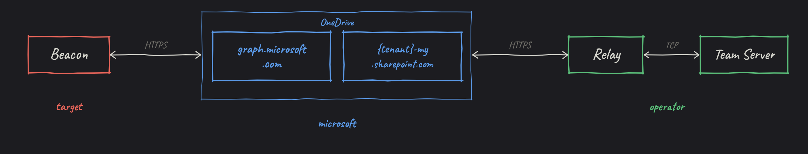
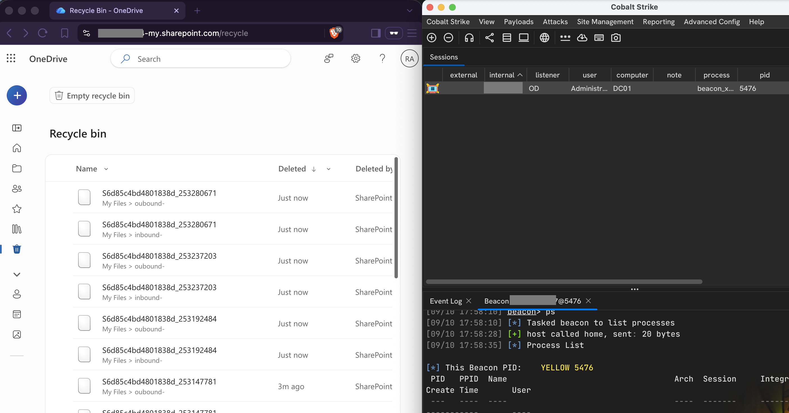

# OneDrive UDC2

A Cobalt Strike User-Defined C2 channel that uses OneDrive as the transport layer.



## What you need

- A Microsoft Entra ID tenant with a user that has OneDrive for
  Business.
- An app registration with the `Files.ReadWrite.All` application permission.

## Setup

### 1. Register an application

In Azure Portal, go to **App registrations** and create a new app:

- **Account type:** Single tenant.
- **Redirect URI:** Leave empty.

Note the **tenant ID** and **client ID** from the overview page.

### 2. Add the Graph permission

Under **API permissions**:

1. Add **Microsoft Graph**, then **Application permissions**, then `Files.ReadWrite.All`.
2. Click **Grant admin consent**.

### 3. Create a client secret

Under **Certificates & secrets**, create a new secret and copy its value.

### 4. Create the OneDrive folders

In the user's OneDrive, create two folders, one for the inbox and one for the
outbox (e.g. `c2inbox` and `c2outbox`).

### 5. Get the drive and folder IDs

Open [Graph Explorer](https://developer.microsoft.com/graph/graph-explorer),
sign in as that user, and run:

```http
GET https://graph.microsoft.com/v1.0/me/drive/root/children
```

Grab the `id` of each folder and the `driveId` from any entry in the JSON response.

## Build

```bash
cp server/config.json.example server/config.json
```

Fill in `server/config.json`:

| Field | Value |
| --- | --- |
| `tenant_id` | Microsoft Entra ID tenant ID |
| `client_id` | Application client ID |
| `client_secret` | Client secret value |
| `drive_id` | OneDrive drive ID |
| `inbox_folder_id` | Inbox folder ID |
| `outbox_folder_id` | Outbox folder ID |

Then build the client:

```bash
make
```

## Run

Start the relay (use `screen` or `tmux` so it stays up if your terminal disconnects):

```bash
python3 server/relay.py --config server/config.json --ts-addr <teamserver-ip> --ts-port <udc2-port>
```

In Cobalt Strike, create a UDC2 listener on the same port and load `client/bof.o`.

### Relay options

| Flag | Description |
| --- | --- |
| `--config` | Path to `config.json` (required) |
| `--ts-addr` | Teamserver IP |
| `--ts-port` | UDC2 listener port |
| `--poll` | Poll interval in seconds (default `2.0`) |
| `--state` | Path to the state file (default: `<config>.state.json`) |
| `--debug` | Enable debug logging |
| `--clean` | Delete state file and spool directory, then exit |

### State, spool & lock file

The relay creates a few files next to your config to keep track of things between restarts:

- **State file** (`config.json.state.json`) - tracks which inbox files have been processed, pending uploads, and beacon session info. Set a custom path with `--state`.
- **Spool directory** (`config.json.state.json.spool/`) - holds response data that hasn't been uploaded to OneDrive yet. If the relay crashes mid-upload, the spool keeps the data so it can retry on next start.
- **Lock file** (`config.json.state.json.lock`) - prevents two relay instances from running against the same state. If you see `Another relay holds the lock` and no other relay is running, the lock is stale from a crash.

### Resetting relay state

If the relay's local state gets corrupted or a stale lock is blocking startup, use `--clean` to wipe the state file and spool directory so the relay starts fresh:

```bash
python3 server/relay.py --config server/config.json --clean
```

The lock file is kept. The relay won't clean while another instance is running. On the next normal start it re-initializes and skips any inbox files older than 30 minutes.

You can also reset manually by deleting the state file and spool directory yourself. If the lock file is stale (no relay running), delete it too.

## Demo



## References

- [Cobalt Strike UDC2 docs](https://hstechdocs.helpsystems.com/manuals/cobaltstrike/current/userguide/content/topics/malleable-c2_user-defined-c2.htm)
- [icmp-udc2](https://github.com/Cobalt-Strike/icmp-udc2/) - UDC2 over ICMP
- [slack-udc2](https://github.com/WKL-Sec/slack-udc2) - UDC2 over Slack
